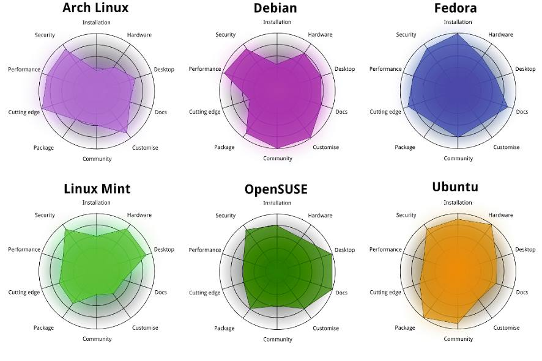
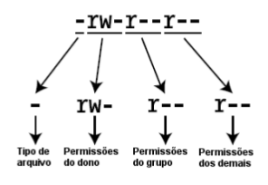
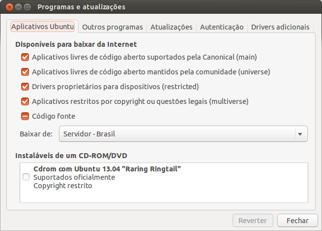

<!-- Algumas modificacoes necessarias enquanto o codigo do Slidify esta -->
<!-- em desenvolvimento -->
<!-- Para as marcacoes funcionarem -->
<style>
strong {
	font-weight: bold;
}
em {
	font-style: italic
}
</style>
<!-- FIM -->

<br><br><br>
### Slides disponíveis em [http://fernandomayer.github.io/linux-intro]()

### Feito com [Slidify](http://slidify.org)

### Melhor visualizado com [Chromium](http://www.chromium.org) (ou [Google Chrome](https://www.google.com/chrome))

### Código-fonte disponível no [GitHub](https://github.com/fernandomayer/linux-intro/tree/gh-pages)

### Pressione "o" para visualizar miniaturas

### Use <i class="icon-arrow-left"> &nbsp; </i><i class="icon-arrow-right"></i> para navegar

---

## Plano do curso

* Software Livre
* Características do Linux
* Principais distribuições
* Contas de usuários
* Comandos básicos
* `...`

--- .segue .nobackground .dark

## Software Livre

--- &twocol

## Software Livre

Richard Stallman - Projeto GNU (1983)

*** =left

<div class="centered">

</div>

*** =right

<div class="centered">

</div>

--- &twocol

## Software Livre

Linus Torvalds - Linux (1991)

*** =left

<div class="centered">

</div>

*** =right

<div class="centered">

</div>

--- &twocol

<br><br><br>
<center>
## GNU + Linux = GNU/Linux
</center>
<br><br>
*** =left

<div class="centered">

</div>

*** =right

<div class="centered">

</div>

---

## Software Livre

### O que é software livre?

- Software que pode ser utilizado, estudado e modificado sem
    restrições
- Pode ser copiado e redistribuido (modificado ou não)
- A redistribuição tem uma única restrição: assegurar que os
    receptores tenham a mesma liberdade
- Para isso é necessário que os desenvolvedores (ou modificadores)
    disponibilizem o **código fonte**!

--- .segue bg:red

<i class="icon-unlock icon-4x pull-left icon-muted"></i>

<br><br><br>
## Atenção!
<br>
## Não confundir software **livre** com software **grátis**
<br>
## Livre como em “liberdade de expressão”, não grátis como “cerveja grátis”


---

## Software Livre

### Um software só é considerado livre quando é possível ter as 4 liberdades

0. Liberdade para usar o programa para qualquer propósito
1. Liberdade para estudar como o programa funciona, e modificá-lo para
    sua necessidade
2. Liberdade para redistribuir cópias (e ajudar o seu vizinho)
3. Liberdade para aprimorar o programa, e redistribuí-lo para que todos
    se beneficiem

---

## Software Livre

### Licenças livres

- GNU General Public License (GPL)
- BSD License
- Mozilla Public License
- MIT License
- Apache License

---

## Software Livre

### Exemplos de software livre que você já usa

- R!
- OpenOffice
- Firefox, Thunderbird
- Google Chrome (no Linux é Chromium)
- $\LaTeX$

---

## Software Livre

### Repositórios de software livre

- GitHub [http://github.com]()
- SourceForge [http://sourceforge.net]()
- Google Code [http://code.google.com]()

---

## Software Livre

### Quem usa software livre?

- Academia
- Indústria
- Governo
    - [http://www.softwarelivre.gov.br]()
    - [http://www.softwarepublico.gov.br]()
    - [https://www.serpro.gov.br]()

--- .segue bg:green
<br>
## Você!
<br>
## A internet e a WWW surgiram do mesmo movimento e princípios do software livre
<br>
## Hoje em dia a grande maioria dos sites usa o servidor Apache e banco de dados POSTGRES para funcionar

---

## Software Livre

### Vantagens do software livre

- Projetos colaborativos: pessoas com experiências e visões diferentes
    contribuem para o benefício comum
- Segurança: *Given enough eyeballs, all bugs are shallow*
- Qualidade: o que é melhor, 12 ou 1M desenvolvedores?
- Sem “caixa preta”: transparência
- Flexibilidade: você decide o que usar e quando usar
- E **também** é de graça!

---

## Software Livre

### Porque devo me importar?

- Por todas as vantagens acima
- Como cientistas
    - Devemos ser transparentes em nossas pesquisas
    - Temos que reportar aquilo que estamos fazendo
    - Temos que provar os resultados que obtemos
    - Nossa pesquisa tem que ser **reproduzível**

---

## Software Livre

### Ciência (Estatística) aberta

Um exemplo: [FOAS](http://www.foastat.org)
<br>
<div class="centered">

</div>

--- .segue .nobackground .dark

## O Sistema Operacional GNU/Linux

--- #myslide

<script>
$('#myslide').on('slideenter', function(){
  $(this).find('article')
    .append('<iframe width="640" height="360" src="//www.youtube.com/embed/yVpbFMhOAwE?rel=0" frameborder="0" allowfullscreen></iframe>')
});
$('#myslide').on('slideleave', function(){
  $(this).find('iframe').remove();
});
</script>

---

## Sistema Operacional

- É um conjunto de programas que fazem a interface entre o usuário e o
  *hardware*
- Sua principal função é o gerenciamento de recursos e periféricos,
  interpretação de mensagens e execução de programas
- Um SO pode ser dividido em duas partes:
	- **Núcleo** ou **kernel** desempenha as funções vitais do sistema
        (baixo-nível) $\rightarrow$ **Linux**
	- **Concha** ou **Shell** é a interface entre o usuário e o
        kernel. Pode ser em um formato "cru" como a linha de comando ou
        mais amigável com janelas gráficas $\rightarrow$ **GNU**
- O conjunto de kernel Linux e dos programas GNU é o sistema operacional
  que chamamos de **GNU/Linux** (ou simplesmente Linux)


---

## Linux

<!-- ### Histórico -->
<!-- - **1969-1973** Ken Thompson e Dennis Ritchie (Bell Labs) $\rightarrow$ -->
<!--     Unix (fechado e caro) -->
<!-- - **1987** Andrew Stuart Tanenbaum $\rightarrow$ Minix (aberto) -->
<!-- - **1991** Linux Torvals $\rightarrow$ Linux -->

### Principais características

- Livre e desenvolvido voluntariamente por programadores experientes,
  hackers, e contribuidores espalhados ao redor do mundo
- Convive pacificamente com outros sistemas operacionais no mesmo
  computador (embora não seja a melhor opção...)
- Multitarefa e multiusuário
- Modular: carrega apenas o necessário e libera memória após a
  utilização
- Não há a necessidade de reiniciar o sistema após a modificar alguma
  configuração ou instalar programas (apenas na atualização de kernel)

---

## Linux

### Principais características

- Roda confortavelmente em sistemas de baixo desempenho (processadores
  antigos, pouca memória RAM)
- **Não é vulnerável à vírus!** Devido à separação de privilégios clara
    entre usuário e administrador, vírus possuem uma ação muito
    limitada, por isso são inúteis. (Esqueça o anti-vírus!)
- Suporte completo e nativo a diversos dispositivos de comunicação (USB,
  Bluetooth, ...)
	  - Raramente serão necessários drivers externos (com excessão de
        tecnologias muito novas)
- Os sistemas de arquivos usados pelo GNU/Linux (Ext3, reiserfs, ...)
  organizam os arquivos de forma inteligente evitando a
  **fragmentação**, tornando um poderoso sistema para aplicações
  exigentes e gravações intensivas. (Esqueça o desfragmentador!)

---

## Linux

### Distribuições do Linux

- Devido à sua liberdade, um grupo de pessoas, empresa ou
  organização pode decidir distribuir uma versão do Linux com diferentes
  características
	  - Facilidade de uso
	  - Foco em desempenho
	  - Agrupar programas de interesse (programação, edição gráfica,
        ...)
- Cada **distribuição** tem uma característica própria como o sistema de
  instalação, objetivo, ..., embora todas apresentem a mesma estrutura
  básica do Linux


---

### Distribuições do Linux

Veja [Distrowatch](http://distrowatch.com)

<div class="centered">

</div>


--- .segue .nobackground .dark

## Ubuntu

---

## Ubuntu

### Origem

- Termo Africano para "humanidade para os outros"
- Uma distribuição Linux baseada na simplicidade, usabilidade e fácil
  instalação
- Baseado na distribuição **Debian**, e patrocinada pela empresa Canonical
- Hoje é mantida pela (ampla) comunidade, apoiada pela Canonical

---

## Ubuntu

### Características

- Novas versões lançadas a cada 6 meses (em maio e outubro)
	- Suporte (atualizações) mantido por 9 meses nas versões normais, e
      por 5 anos nas versões LTS (Long Term Support)
- Central de programas com mais de 40000 pacotes disponíveis (incluindo
  R, $\LaTeX$, $\ldots$)
- Funciona "Live": através de um pen-drive ou DVD, sem necessidade de
  instalação
- Diversos "sabores":
	- [Edubuntu](http://www.edubuntu.org)
	- [Xubuntu](http://www.xubuntu.org)
	- [Ubuntu GNOME](http://ubuntugnome.org)
	- [Ubuntu Studio](http://ubuntustudio.org)

---

## Linux

### GUIs (Graphical User Interface)

Diversas cascas (*shell*) existem para o Linux. Algumas das principais
são:
- [Gnome](http://www.gnome.org)
- [KDE](http://www.kde.org)
- [XFCE](http://www.xfce.org)
- [Unity](https://unity.ubuntu.com)

Além, é claro, do **terminal**, onde você possui uma interação mais
"direta" com o kernel (veremos adiante).

Aqui você também tem a opção de escolha!

--- .segue .nobackgroun bg:brown

<br>
## Conheça o Ubuntu 12.04 LTS e sua interface Unity
<br><br><br><br>
<center>
<i class="icon-arrow-down icon-4x icon-muted"></i>
</center>

---

### Procure, abra e mexa:

- Firefox (entre em [http://fernandomayer.github.io/linux-intro]())
- LibreOffice Writer
- LibreOffice Calc
- gedit
- TeXMaker
- Nautilus
- R (ver link para RStudio Server)

---

## Linux

### Estrutura básica de diretórios

**O mais importante:** no Linux os diretórios são separados por `/` e
  não por `\` como no Windows
- Além disso, uma `/` (barra sozinha) tem um significado especial: é a
  **raíz de todo o sistema**, ou seja, todos os diretórios começam a
  partir dela.

Alguns dos principais diretórios são:
- `/bin`: arquivos executáveis de programas
- `/boot`: arquivos de inicialização do sistema
- `/etc`: arquivos de configuração
- `/usr`: arquivos de programas (a maior parte)
- `/home`: arquivos pessoais do usuário

---

### Estrutura básica de diretórios

<div class="centered">

</div>

--- .segue bg:green

<i class="icon-home icon-4x pull-left icon-muted"></i>

<br><br><br><br><br><br><br>
## Não há lugar como o nosso `/home`

--- 

## Linux

### O diretório `/home`

- O único diretório que você terá acesso (permissão de leitura e
  gravação) como usuário comum
- Cada usuário (em um mesmo computador) possui seu diretório no `/home`,
  completamente independente um do outro
	  - `/home/fernando`
	  - `/home/nakamura`
- Cada usuário possui um nome e uma senha para login
- Arquivos de configuração pessoais ficam sempre em `/home/usuario`

---

## Linux

### Contas de usuários

- Um conceito fundamental no Linux é a distinção clara entre usuário
  comum e o usuário `root`, ou o **super-usuário**
- O usuário `root` é único, e ocupa o posto mais alto na hierarquia de
  permissões (pode fazer tudo!)
- Os usuários comuns (no plural) possuem ações limitadas (por exemplo,
  não podem instalar programas) e acesso apenas ao `/home`
- Para um (ou mais) usuários pode ser atribuído os privilégios do `root`
  $\rightarrow$ são os **sudoers** (este é o padrão adotado pelo Ubuntu)

<div class="alert alert-info">
 <p>Esse é um dos motivos da grande segurança proporcionada pela Linux!</p>
</div>

---

### A fisionomia dos super-usuários

<div class="centered">

</div>

--- .segue .nobackground .dark

## <i class="icon-terminal icon-muted"></i> O Terminal 

---

## Linux

### Terminal

- O terminal (ou *shell*) é um interpretador de comandos que permite a
  interação entre o usuário e o sistema de uma forma mais direta

<div class="centered">

</div>


---

## Linux

### Terminal

- O terminal padrão do Linux é o `Bash`, mas existem outros (`sh`,
  `zsh`, ...)
- Um terminal pode ser:
	- **Interativo**: comandos são digitados e imediatamente executados
	- **Não interativo**: comandos são organizados em um *script* e
        depois executados (*shell script*)
- Um terminal pode ser aberto como um programa comum na interface (GUI)
  do Linux
- Ou, sem interface gráfica através dos comandos `<Ctrl><Alt><F1>`
	- Do `<F1>` ao `<F6>` são terminais independentes
	- A interface gráfica fica no `<F7>`

---

## Linux

### Abra um terminal (na GUI):

```bash
aluno@lce:~$
```
- Tudo que está antes de `:` é o usuário logado (`aluno`) e o nome da
  máquina (`lce`)
- Depois de `:` fica o diretório atual
	- O símbolo `~` é um atalho (*alias*) para `/home/usuario`
- Veja:
	- `pwd` mostra o diretório atual
	- `ls` lista os diretórios e arquivos presentes no diretório atual
	- `whoami` (em caso de dúvida existencial...)

---

## Linux

### Terminal

- Em caso de dúvida sobre como funciona um comando ou sua utilidade,
  abra a página de ajuda com o `man`. Por exemplo,

```bash
aluno@lce:~$ man ls
```
- Navegue com as setas e aperte `q` para sair e voltar ao terminal
- Muitas opções podem ser passadas a um comando, sempre precedidas de
  `-`, e com um espaço. Por exemplo

```bash
aluno@lce:~$ ls -l
```
- A opção (*flag*) `-l` faz com que a saída do `ls` seja em formato de
  lista

---

## Linux

### Terminal

Mais opções podem ser passadas ao mesmo tempo. Por exemplo

```bash
aluno@lce:~$ ls -lah
```
Estas três opções juntas fazem com que o `ls`:
- Retorne uma lista `l`
- Mostre os arquivos ocultos `a` (ou `--all`)
- Mostre os tamanhos dos arquivos em formato para humanos `h`

--- bg:red

## Importante!

### Arquivos ocultos

- Um arquivo (ou diretório) oculto no Linux é simplesmente um arquivo que
	contém um ponto (`.`) na frente do nome.
- Por exemplo:
	- `arquivo.txt` é um arquivo normal
	- `.arquivo.txt` é um arquivo oculto
- Normalmente são utilizados para arquivos de configuração
- No Nautilus, aperte `<Ctrl><h>` para habilitar/desabilitar a
  visualização destes arquivos

---

## Linux

### Terminal

A saída do comando `ls -lah` mostra uma série de resultados
interessantes. Por exemplo:

```bash
fernando@kirk:~$ ls -lah
total 11M
drwxr-xr-x 42 fernando fernando 4,0K Ago 30 15:24 .
drwxr-xr-x  4 root     root     4,0K Jul 25 22:59 ..
drwx------  3 fernando fernando 4,0K Ago 30 12:37 .dropbox
drwx------ 31 fernando fernando 4,0K Ago 30 12:37 Dropbox
drwxr-xr-x 13 fernando fernando 4,0K Ago 27 22:29 Music
-rw-rw-r--  1 fernando fernando   47 Jul 26 04:12 .Renviron
-rw-rw-r--  1 fernando fernando  780 Ago 22 14:23 .Rprofile
drwxrwxr-x  9 fernando fernando 4,0K Ago  6 14:08 Ubuntu One
drwxr-xr-x  4 fernando fernando 4,0K Ago 28 00:58 Videos
```

---

## Linux

### Terminal

De trás pra frente temos

- O nome do arquivo ou diretório
	- Um ponto `.` significa **este diretório**
	- Dois pontos `..` representa o **diretório acima**
- A data de última modificação
- O tamanho do arquivo, em Kb, MB ou GB (porque usamos a opção `h`)
- O dono (usuário) do arquivo/diretório e o grupo ao qual pertence
	- Normalmente um usuário pertence à vários grupos que dão acesso à
      arquivos comuns (não iremos nos aprofundar em permissões de
      grupos)
- O número de arquivos contidos em um diretório (para arquivos será
  sempre 1)
- As permissões de acesso

---

## Linux

### Permissões

A primeira coluna mostra as permissões para cada arquivo/diretório, e
funciona assim:

<div class="centered">

</div>
<br>

- O primeiro *string* mostra se é um diretório `d` ou um arquivo comum
  `-`
- Os outros 9 caracteres são divididos em três grupos, referente às
  permissões de usuário (dono), do grupo, e demais usuários

---

## Linux

### Permissões

As permissões para o usuário, grupo e demais podem ser

Caracter | Permissão
---------|----------
`r`      | Permissão de leitura (*read*)
`w`      | Permissão de escrita (*write*)
`x`      | Permissão de execução (*execute*)
`-`      | Permissão desabilitada

---

## Linux

### Permissões

Dessa forma,

```bash
drwxr-xr-x 13 fernando fernando 4,0K Ago 27 22:29 Music
-rw-rw-r--  1 fernando fernando  780 Ago 22 14:23 .Rprofile
```

- `Music` é um diretório (`d`), do usuário `fernando`, do grupo
  `fernando`
	  - O dono possui permissão de gravação, escrita e execução (`rwx`)
	  - O grupo e os demais possuem permissão de leitura e execução (`r-x`)
- `.Rprofile` é um arquivo comum (`-`) (e oculto!)
      - O dono e o grupo possuem permissão de leitura e gravação (`rw-`)
	  - Os demais possuem permissão de leitura apenas (`r--`)

---

## Linux

### Terminal

Para mudar de diretório, use o comando `cd` (*change directory*)

```bash
aluno@lce:~$ cd Documentos
aluno@lce:~/Documentos$
```

Note que `Documentos` é um diretório que está em `/home/aluno`. Como
você já está em `/home/aluno` não é necessário especificar todo o
caminho novamente, mas esse comando é equivalente a

```bash
aluno@lce:~$ cd /home/aluno/Documentos
```
Ou

```bash
aluno@lce:~$ cd ~/Documentos
```

---

### Tente a seguinte sequência de comandos:

Um `#` é um comentário

```bash
cd /
pwd
ls
cd /home
pwd
ls
cd /usr
pwd
ls
cd # O que acontece aqui?
pwd
ls
cd ~ # E aqui?
pwd
ls
```

---

### Agora veja

```bash
aluno@lce:~$ cd Documentos
aluno@lce:~/Documentos$ pwd
/home/aluno/Documentos
aluno@lce:~/Documentos$ cd ..
aluno@lce:~$ pwd
/home/aluno
aluno@lce:~$ cd -
aluno@lce:~/Documentos$ pwd
/home/aluno/Documentos
```
<br>
- `cd ..` volta um diretório acima (lembra do `..` no `ls -lah`?)
- `cd -` volta para o último diretório visitado

---

## Linux

### Terminal

Para **criar** um diretório, use o comando `mkdir` (*make directory*)

```bash
aluno@lce:~$ ls
aluno@lce:~$ mkdir curso_linux
aluno@lce:~$ ls
aluno@lce:~$ cd curso_linux
aluno@lce:~/curso_linux$ ls
```

---

## Importante!

### Nomes de comandos e diretórios

- Os nomes de comandos são *case-sensitive*, ou seja

<center>
`ls` $\neq$ `Ls` $\neq$ `LS`
</center>

- Os nomes de diretórios e arquivos são *case-sensitive*, portanto

<center>
`curso_linux` $\neq$ `Curso_linux` $\neq$ `Curso_Linux` $\neq$ `CURSO_LINUX`
</center>

- Note que você pode ter o mesmo nome de diretório capitalizado
  diferente em um mesmo lugar, mas serão independentes

- Os nomes de diretórios e arquivos *podem* conter espaços (ex.: `curso
  linux`), mas você realmente não vai querer fazer isso
  <i class="icon-smile"></i>

- Use o `<Tab>` para autocompletar comandos e nomes de arquivos/diretórios!

---

## Linux

### Terminal

Para **remover** um diretório, use o comando `rm` (*remove*)

```bash
aluno@lce:~$ rm -r curso_linux
aluno@lce:~$ ls
```

- A opção `-r` é necessária para remover recursivamente um diretório
- Se o diretório estiver vazio, podemos usar apenas `rmdir curso_linux`

<div class="alert alert-info">
 <p>Cuidado! Remover pelo terminal não tem volta!</p>
</div>

---

## Linux

### Terminal

Para **criar** um arquivo de texto, podemos usar o gedit

```bash
aluno@lce:~$ mkdir curso_linux
aluno@lce:~$ cd curso_linux/
aluno@lce:~/curso_linux$ ls
aluno@lce:~/curso_linux$ gedit arquivo.txt &
```
- Escreva alguma coisa, salve e feche o programa
- Note o `&` no final do comando: ele serve para executar e retornar
  para a linha de comando (caso contrário, o terminal ficaria "ocupado")
<div class="alert alert-info">
 <p>O comando `gedit` também pode ser usado para **abrir** arquivos de
  texto já existentes</p>
</div>

---

## Linux

### Terminal

Para **copiar** um arquivo usamos o `cp` (*copy-paste*) que tem a
seguinte sintaxe

```bash
cp <arquivo original> <arquivo cópia>
```
Por exemplo, para copiar `arquivo.txt` de `/home/aluno/curso_linux` para
`/home/aluno/Documentos`

```bash
aluno@lce:~/curso_linux$ cp arquivo.txt /home/aluno/Documentos
```
Note que qualquer um destes comandos faria a mesma coisa

```bash
cp arquivo.txt ~/Documentos
cp arquivo.txt ../Documentos
```

---

## Linux

### Terminal

Para copiar um arquivo de um diretório para o atual, por exemplo

```bash
aluno@lce:~/curso_linux$ cd ../Documentos
aluno@lce:~/Documentos$ cp ~/curso_linux/arquivo.txt .
```
- Note que o ponto `.` no final representa o diretório atual

Para copiar **todos** os arquivos de um diretório para outro

```bash
aluno@lce:~/Documentos$ cd
aluno@lce:~$ cp curso_linux/* Downloads
```
- O asterisco `*` dentro de um diretório significa "tudo" que estiver
  dentro dele

---

## Linux

### Terminal

Para **mover** um arquivo entre diretórios usamos o `mv` (*move*), que
possui a mesma sintaxe e funciona da mesma forma que o `cp`. Por exemplo

```bash
aluno@lce:~$ mv curso_linux/arquivo.txt .
```
O comando `mv` também serve para **renomear** um arquivo, se for
aplicado no mesmo diretório. Por exemplo, para renomear `arquivo.txt`
para `arquivo_curso.txt`

```bash
aluno@lce:~$ mv arquivo.txt arquivo_curso.txt
```

---

## Linux

### Terminal

Para **remover** um arquivo qualquer, usamos o `rm` novamente

```bash
aluno@lce:~$ rm arquivo_curso.txt
```

Para remover todos os arquivos de um diretório, mas sem remover o
diretório em si também usamos o `*`

```bash
aluno@lce:~$ rm curso_linux/*
```
<div class="alert alert-info">
<p>Novamente cuidado! O rm vai remover tudo sem nenhum aviso e sem
 possibilidade de restauração!</p>
</div>

---

## Linux

### Alguns comandos úteis para arquivos de texto

```bash
# mostra o tipo de arquivo, codificação de carecteres, ...
aluno@lce:~$ file arquivo.txt 
# imprime na tela todo o conteúdo do arquivo
aluno@lce:~$ cat arquivo.txt 
# imprime as 10 primeiras linhas
aluno@lce:~$ head arquivo.txt 
# imprime as 10 últimas linhas
aluno@lce:~$ tail arquivo.txt 
```

---

## Exercícios

1. Visite os seguintes diretórios, utilizando o comando `cd`, use `pwd`
para conferir o local e `ls` para listar o conteúdo
	- `/home`, `/proc`, `/boot`, `/usr/bin`
2. Em `/home/aluno` crie um diretório com seu nome e
	1. Entre nesse diretório e crie um novo diretório chamado
      `curso_linux`
	2. Crie um arquivo de texto (`teste.txt`) com algum conteúdo
	- Crie outro arquivo de texto oculto (`.oculto.txt`)
	- Copie `teste.txt` para o seu diretório `curso_linux`
	- Copie `teste.txt` para o diretório `~/Documentos`
	- Renomeie `teste.txt` para `delete.txt`
	- Mova `delete.txt` para o diretório `curso_linux`
	- Remova o diretório `curso_linux`
	- O que sobrou no diretório com seu nome?

---

## Desafio

### Baixar e instalar o Rgedit plugin

1. Baixar o código fonte em [http://rgedit.sourceforge.net]()
2. Descompactar o arquivo pelo terminal
	- Dica: `tar -jxvf <arquivo.tar.bz2>`
3. Entre no diretório descompactado
4. Abra o `ReadMe.txt` no `gedit` e leia as instruções
	- Dica: você está usando o gedit3 (verifique a versão pelo menu
      do prórpio programa)
5. Abra o gedit, habilite o plugin (conforme descrito no `ReadMe.txt`) e
   tente rodar algum comando do R

>- Você está usando uma conta de usuário comum (`aluno`). Porque então
	conseguiu instalar alguma coisa no sistema??

--- .segue .nobackground .dark

## Instalação do Ubuntu

---

## Antes de tudo:

### Faça um backup dos seus dados!

### Se você planeja instalar lado-a-lado com o Windows, terá que fazer a desfragmentação da partição

### Baixar a última versão do Ubuntu (13.04 codinome Raring Ringtail)

- Entre em [http://ubuntu.c3sl.ufpr.br/releases/raring]()
	  - Escolha a versão 32 bits para computadores antigos (com menos de
        3 GB de RAM)
	  - Escolha a versão 64 bits para computadores mais novos (com
        Windows 8 ou com mais de 3 GB de RAM)
- Gravar a imagem (`iso`) em um DVD ou criar um pen-drive

---

### Criando um pen-drive de inicialização

- Iniciar o sistema por um pen-drive é mais rápido do que pelo DVD
- Se for usar o Windows, é necessário baixar e instalar o
  [Universal USB Installer](http://www.pendrivelinux.com/universal-usb-installer-easy-as-1-2-3/)
	  - Siga as instruções do
        [site do Ubuntu](http://www.ubuntu.com/download/desktop/create-a-usb-stick-on-windows)
- Se estiver usando um computador do Lab no Linux, abra o "Criador de
  discos de inicialização" ou `usb-creator` (já instalado)

### Para iniciar a instalação

- Insira o pen-drive ou DVD, reinicie e espera até carregar o sistema
	- Caso não entre, reinicie novamente e durante a inicialização
      aperte `F12` ou `Esc` para escolher o dispositivo de inicialização

---

### Mas, antes de entrar na Matrix ...

<div class="centered">

</div>

---

## Tipos de partições

O particionamento de disco é o ato de dividir um disco rígido em
múltiplas unidades, ou **partições**, fazendo com que cada unidade seja
tratada como um disco $\rightarrow$ isto é o que possibilita que vários
sistemas operacionais sejam instalados em um mesmo disco. As partições
podem ser

- **Primárias**: deve haver pelo menos uma, e no máximo quatro partições
    primárias em um disco
- **Estendidas**: só pode haver uma partição estendida, que é tratada
    como uma partição primária. Serve para abrigar outras partições do
    tipo lógicas
- **Lógicas**: são as partições que residem dentro das estendidas. Devem
    existir pelo menos uma e no máximo 12 partições lógicas dentro de
    uma estendida

---

## Tipos de partições

No Linux, as partições estão localizadas no `/dev/sda` (se houver mais
de um disco será `/dev/sdb`, ...):

- `/dev/sda1` até `/dev/sda4` são reservados para partições primárias
- `/dev/sda5` até `/dev/sda16` são reservados para as partições lógicas

> Note que uma partição estendida ocupa o lugar de uma primária

Dessa forma, se um disco possui 1 partição primária, 1 estendida, e
3 lógicas:

- `/dev/sda1` $\rightarrow$ primária
- `/dev/sda2` $\rightarrow$ estendida
	- `/dev/sda5` $\rightarrow$ lógica
	- `/dev/sda6` $\rightarrow$ lógica
	- `/dev/sda7` $\rightarrow$ lógica

---

## Tipos de partições

### A partição SWAP

- A SWAP é um tipo especial de partição no Linux
- O Linux divide a memória RAM em "pedaços" de memória, chamados de
*páginas*
- Quando a memória RAM fica lotada com estas páginas, o sistema usa este
  espaço no disco rígido (a SWAP) para armazenar este excesso de páginas
  ("paginação")
- Isso faz com que o sistema não "trave" por falta de memória <i class="icon-thumbs-up"></i>
- Normalmente é recomendado criar uma partição SWAP com o dobro de
  tamanho da memória RAM

---

## Sistemas de arquivos

### Toda partição deve ter um sistema de arquivos

- Um sistema de arquivos é uma forma de organização de dados, que
  especifica como o sistema operacional deve armazenar, ler e gravar
- No Windows os mais usados são: `fat32` e `ntfs`
- No Linux existem mais opções como
	- `Ext3`, `Ext4`
	- `reiserFS`
	- `XFS`
- O mais utilizado (e provavelmente mais estável) é o `Ext4`

---

### Agora sim ...

<div class="centered">

</div>

---

## Instalação

### Etapas

1. Rode o sistema pelo DVD ou pen-drive e vá em **Experimentar Ubuntu**
2. Abra o editor de partições `gparted` e veja como está seu HD
	- Se for instalar lado-a-lado com o Windows, redimensione (diminua)
      a partição
3. Crie as partições conforme necessário
    - Lembre dos tipos de partições existentes
	- Use `Ext4` para o sistema de arquivos
	- Não esqueça da SWAP
4. Clique no ícone para instalar o Ubuntu e siga os passos
    - Na tela **Tipo de instalação** selecione a **opção avançada**
	- Selecione a partição de instalação e clique em **Change** para
      selecionar o sistema de arquivos e o ponto de montagem (geralmente
      apenas o `/`)
5. Preencha os dados necessários e bem vindo ao Ubuntu

---

## Instalação

### O que fazer após a instalação

**Importante!** 99,9% dos softwares que você precisa estão disponíveis
  em repositórios próprios do Ubuntu. Sempre instale os programas destes
  repositórios para garantir compatibilidade e segurança!

- Abra a "Central de Software", procure e instale o `synaptic`
- O Synaptic é um gerenciador de pacotes mais eficiente e altamente
  recomendado para uso no lugar da "Central de Software"

---

## Instalação

### O que fazer após a instalação

Entre nas configurações e "Programas e atualizações". Certifique-se
que todas as opções da aba "Aplicativos Ubuntu" estejam marcados

<div class="centered">

</div>

---

## Instalação

### O que fazer após a instalação

Abra o Synaptic e instale os seguintes pacotes:

- `default-jdk` e `icedtea-plugin` para instalar Java (BB, ...)
- `chromium-browser` para o Chromium
- `texlive-full` para a distribuiçao $\TeX$Live completa
- `texmaker` para edição dos arquivos `.tex`

Procure o que mais quiser por ali

---

## Instalação

### O que fazer após a instalação

Dropbox

- O driver para o Dropbox é proprietário e não está nos repositórios do
  Ubuntu
- É um dos 0,01% dos programas que precisam ser baixados e instalados
  separadamente
- Entre no
  [site do Dropbox para Linux](https://www.dropbox.com/install?os=lnx) e
  escolha a versão 32-bit ou 64-bit para Ubuntu
- Você vai baixar um arquivo `.deb`
	- Clicando 2 vezes abrirá a "Central de Programas" e você terá a
      opção de instalar

---

## Instalação

### O que fazer após a instalação

**R**

Nos respositórios do Ubuntu ja existe o R (pacote `r-base`), mas sempre
em uma versão mais antiga. Para instalar e manter sempre a última versão
do R basta adicionar um repositório do CRAN.

- As instruções estão na própria
  [página do CRAN para Ubuntu](http://cran.r-project.org/bin/linux/ubuntu)
- Você pode adicionar o repositório usando a interface gráfica
	- Entre nas configurações e clique em "Programas e atualizações"
	- Na aba "Outros programas", clique em "Adicionar" e cole o
      repositório conforme mostrado na página do CRAN
- **Mas** é muito mais divertido fazer isso pelo **terminal**...

---

## R

Para adicionar o repositório do CRAN com a última versão do R para
Ubuntu, no terminal

- Abra (com o `gedit`) o arquivo `/etc/apt/sources.list`

```bash
sudo gedit /etc/apt/sources.list &
```
- Esse arquivo contém o endereço de todos os repositórios de software
- Note o comando `sudo` antes do `gedit`
	- Como o arquivo `sources.list` não está no seu `/home`, é
      necessário ser um super-usuário para alterá-lo
	- O `sudo` (*super-user do*) permite que você execute apenas um
      comando específico como super-usuário (porque você é um *sudoer*
      no sistema)

Continua...

---

### sudo
<br><br>
<div class="centered">

</div>

---

## R

- Dentro do `/etc/apt/sources.list` adicione a seguinte linha, referente
  ao repositório CRAN

```
deb http://brieger.esalq.usp.br/CRAN/bin/linux/ubuntu raring/
```
- Para atualizar os pacotes

```bash
sudo apt-get update
```
- E para instalar o R

```bash
sudo apt-get install r-base r-base-dev
```
- Para abrir o R

```bash
R
```
**Sim, o R é um programa que roda no terminal**

---

## R

Para usar o R de forma apropriada você pode escolher entre muitos
editores como

- Emacs com ESS (altamente recomendado!)
- Rgedit plugin para o gedit (já vimos aqui)
- Vim-R-plugin (para o editor `vim`)
- Rstudio
	- A versão do Rstudio para Ubuntu pode ser baixada em
      [http://www.rstudio.com/ide/download/desktop]() como um arquivo
      `.deb` (confira se a versão é 32-bit ou 64-bit)
	- Para instalar, clique duas vezes para abrir a "Central de
      Programas"


---

## Onde buscar ajuda (geral)

Sites

- Google nunca falha
- [Ubuntu Forums](http://ubuntuforums.org)
- [Ubuntu Forums Português](http://ubuntuforum-br.org)

Apostilas

- [Guia FOCA](http://www.guiafoca.org)
- [Linux Básico - PET Computação UFPR](http://www.inf.ufpr.br/nicolui/Docs/Livros/LinuxBasico)
- [Outra apostila do PET UFPR (em PDF)](http://pet.inf.ufpr.br/Apostilas/ApostilaLinux.pdf)
