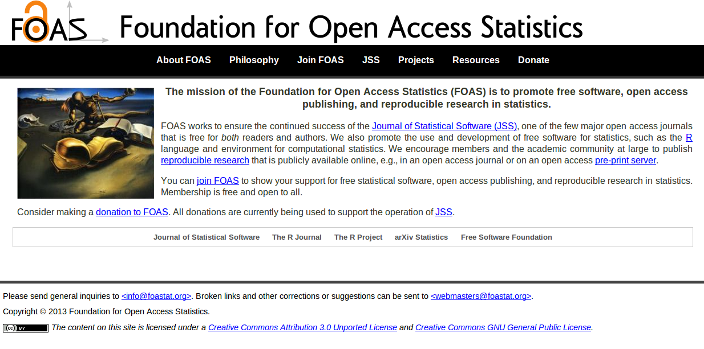
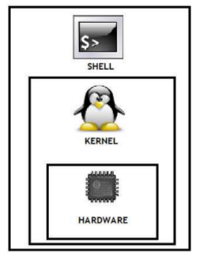

<!-- Algumas modificacoes necessarias enquanto o codigo do Slidify esta -->
<!-- em desenvolvimento -->
<!-- Para as marcacoes funcionarem -->
<style>
strong {
	font-weight: bold;
}
em {
	font-style: italic
}
</style>
<!-- FIM -->

<br><br><br>
### Slides disponíveis em [http://fernandomayer.github.io/linux-intro]()

### Feito com [Slidify](http://slidify.org)

### Melhor visualizado com [Chromium](http://www.chromium.org) (ou [Google Chrome](https://www.google.com/chrome))

### Código-fonte disponível no [GitHub](https://github.com/fernandomayer/linux-intro/tree/gh-pages)

### Pressione "o" para visualizar miniaturas

### Use <i class="icon-arrow-left"> &nbsp; </i><i class="icon-arrow-right"></i> para navegar

---

## Plano do curso

* Software Livre
* Características do Linux
* Principais distribuições
* Contas de usuários
* Comandos básicos
* `...`

--- .segue .nobackground .dark

## Software Livre

--- &twocol

## Software Livre

Richard Stallman - Projeto GNU (1983)

*** =left

<div class="centered">

</div>

*** =right

<div class="centered">

</div>

--- &twocol

## Software Livre

Linus Torvalds - Linux (1991)

*** =left

<div class="centered">

</div>

*** =right

<div class="centered">

</div>

--- &twocol

<br><br><br>
<center>
## GNU + Linux = GNU/Linux
</center>
<br><br>
*** =left

<div class="centered">

</div>

*** =right

<div class="centered">

</div>

---

## Software Livre

### O que é software livre?

- Software que pode ser utilizado, estudado e modificado sem
    restrições
- Pode ser copiado e redistribuido (modificado ou não)
- A redistribuição tem uma única restrição: assegurar que os
    receptores tenham a mesma liberdade
- Para isso é necessário que os desenvolvedores (ou modificadores)
    disponibilizem o **código fonte**!

--- .segue bg:red

<i class="icon-unlock icon-4x pull-left icon-muted"></i>

<br><br><br>
## Atenção!
<br>
## Não confundir software **livre** com software **grátis**
<br>
## Livre como em “liberdade de expressão”, não grátis como “cerveja grátis”


---

## Software Livre

### Um software só é considerado livre quando é possível ter as 4 liberdades

0. Liberdade para usar o programa para qualquer propósito
1. Liberdade para estudar como o programa funciona, e modificá-lo para
    sua necessidade
2. Liberdade para redistribuir cópias (e ajudar o seu vizinho)
3. Liberdade para aprimorar o programa, e redistribuí-lo para que todos
    se beneficiem

---

## Software Livre

### Licenças livres

- GNU General Public License (GPL)
- BSD License
- Mozilla Public License
- MIT License
- Apache License

---

## Software Livre

### Exemplos de software livre que você já usa

- R!
- OpenOffice
- Firefox, Thunderbird
- Google Chrome (no Linux é Chromium)
- LaTeX

---

## Software Livre

### Repositórios de software livre

- GitHub [http://github.com]()
- SourceForge [http://sourceforge.net]()
- Google Code [http://code.google.com]()

---

## Software Livre

### Quem usa software livre?

- Academia
- Indústria
- Governo
    - [http://www.softwarelivre.gov.br]()
    - [http://www.softwarepublico.gov.br]()
    - [https://www.serpro.gov.br]()

--- .segue bg:green
<br>
## Você!
<br>
## A internet e a WWW surgiram do mesmo movimento e princípios do software livre
<br>
## Hoje em dia a grande maioria dos sites usa o servidor Apache e banco de dados POSTGRES para funcionar

---

## Software Livre

### Vantagens do software livre

- Projetos colaborativos: pessoas com experiências e visões diferentes
    contribuem para o benefício comum
- Segurança: *Given enough eyeballs, all bugs are shallow*
- Qualidade: o que é melhor, 12 ou 1M desenvolvedores?
- Sem “caixa preta”: transparência
- Flexibilidade: você decide o que usar e quando usar
- E **também** é de graça!

---

## Software Livre

### Porque devo me importar?

- Por todas as vantagens acima
- Como cientistas
    - Devemos ser transparentes em nossas pesquisas
    - Temos que reportar aquilo que estamos fazendo
    - Temos que provar os resultados que obtemos
    - Nossa pesquisa tem que ser **reproduzível**

---

## Software Livre

### Ciência (Estatística) aberta

Um exemplo: [FOAS](http://www.foastat.org)
<br>
<div class="centered">

</div>

--- .segue .nobackground .dark

## O Sistema Operacional GNU/Linux

--- #myslide

<script>
$('#myslide').on('slideenter', function(){
  $(this).find('article')
    .append('<iframe width="640" height="360" src="//www.youtube.com/embed/yVpbFMhOAwE?rel=0" frameborder="0" allowfullscreen></iframe>')
});
$('#myslide').on('slideleave', function(){
  $(this).find('iframe').remove();
});
</script>

---

## Sistema Operacional

- É um conjunto de programas que fazem a interface entre o usuário e o
  *hardware*
- Sua principal função é o gerenciamento de recursos e periféricos,
  interpretação de mensagens e execução de programas
- Um SO pode ser dividido em duas partes:
	- **Núcleo** ou **kernel** desempenha as funções vitais do sistema
        (baixo-nível) $\rightarrow$ **Linux**
	- **Concha** ou **Shell** é a interface entre o usuário e o
        kernel. Pode ser em um formato "cru" como a linha de comando ou
        mais amigável com janelas gráficas $\rightarrow$ **GNU**
- O conjunto de kernel Linux e dos programas GNU é o sistema operacional
  que chamamos de **GNU/Linux** (ou simplesmente Linux)


---

## Linux

<!-- ### Histórico -->
<!-- - **1969-1973** Ken Thompson e Dennis Ritchie (Bell Labs) $\rightarrow$ -->
<!--     Unix (fechado e caro) -->
<!-- - **1987** Andrew Stuart Tanenbaum $\rightarrow$ Minix (aberto) -->
<!-- - **1991** Linux Torvals $\rightarrow$ Linux -->

### Principais características

- Livre e desenvolvido voluntariamente por programadores experientes,
  hackers, e contribuidores espalhados ao redor do mundo
- Convive pacificamente com outros sistemas operacionais no mesmo
  computador (embora não seja a melhor opção...)
- Multitarefa e multiusuário
- Modular: carrega apenas o necessário e libera memória após a
  utilização
- Não há a necessidade de reiniciar o sistema após a modificar alguma
  configuração ou instalar programas (apenas na atualização de kernel)

---

## Linux

### Principais características

- Roda confortavelmente em sistemas de baixo desempenho (processadores
  antigos, pouca memória RAM)
- **Não é vulnerável à vírus!** Devido à separação de privilégios clara
    entre usuário e administrador, vírus possuem uma ação muito
    limitada, por isso são inúteis. (Esqueça o anti-vírus!)
- Suporte completo e nativo a diversos dispositivos de comunicação (USB,
  Bluetooth, ...)
	  - Raramente serão necessários drivers externos (com excessão de
        tecnologias muito novas)
- Os sistemas de arquivos usados pelo GNU/Linux (Ext3, reiserfs, ...)
  organizam os arquivos de forma inteligente evitando a
  **fragmentação**, tornando um poderoso sistema para aplicações
  exigentes e gravações intensivas. (Esqueça o desfragmentador!)

---

## Linux

### Distribuições do Linux

- Devido à sua liberdade, um grupo de pessoas, empresa ou
  organização pode decidir distribuir uma versão do Linux com diferentes
  características
	  - Facilidade de uso
	  - Foco em desempenho
	  - Agrupar programas de interesse (programação, edição gráfica,
        ...)
- Cada **distribuição** tem uma característica própria como o sistema de
  instalação, objetivo, ..., embora todas apresentem a mesma estrutura
  básica do Linux


---

## Linux

### Distribuições do Linux

Figura com vários logos

--- .segue .nobackground .dark

## Ubuntu

---

## Ubuntu

### Origem

- Termo Africano para "humanidade para os outros"
- Uma distribuição Linux baseada na simplicidade, usabilidade e fácil
  instalação
- Baseado na distribuição **Debian**, e patrocinada pela empresa Canonical
- Hoje é mantida pela (ampla) comunidade, apoiada pela Canonical

---

## Ubuntu

### Características

- Novas versões lançadas a cada 6 meses (em maio e outubro)
	- Suporte (atualizações) mantido por 9 meses nas versões normais, e
      por 5 anos nas versões LTS (Long Term Support)
- Central de programas com XXXX pacotes disponíveis
- Funciona "Live": através de um pen-drive ou DVD, sem necessidade de
  instalação
- Diversos "sabores":
	- [Edubuntu](http://www.edubuntu.org)
	- [Xubuntu](http://www.xubuntu.org)
	- [Ubuntu GNOME](http://ubuntugnome.org)
	- [Ubuntu Studio](http://ubuntustudio.org)

---

## Linux

### GUIs (Graphical User Interface)

Diversas cascas (*shell*) existem para o Linux. Algumas das principais
são:
- [Gnome](http://www.gnome.org)
- [KDE](http://www.kde.org)
- [XFCE](http://www.xfce.org)
- [Unity](https://unity.ubuntu.com)

Além, é claro, do **terminal**, onde você possui uma interação mais
"direta" com o kernel (veremos adiante).

Aqui você também tem a opção de escolha!

--- .segue .nobackgroun bg:brown

<br>
## Conheça o Ubuntu 12.04 LTS e sua interface Unity
<br>
<i class="icon-arrow-down icon-4x icon-muted"></i>

---

### Procure, abra e mexa:

- Firefox (entre em [http://fernandomayer.github.io/linux-intro]())
- LibreOffice Writer
- LibreOffice Calc
- gedit
- TeXMaker
- Nautilus
- R (ver link para RStudio Server)

---

## Linux

### Estrutura básica de diretórios

**O mais importante:** no Linux os diretórios são separados por `/` e
  não por `\` como no Windows
- Além disso, uma `/` (barra sozinha) tem um significado especial: é a
  **raíz de todo o sistema**, ou seja, todos os diretórios começam a
  partir dela.

Alguns dos principais diretórios são:
- `/bin`: arquivos executáveis de programas
- `/boot`: arquivos de inicialização do sistema
- `/etc`: arquivos de configuração
- `/usr`: arquivos de programas (a maior parte)
- `/home`: arquivos pessoais do usuário

---

### Estrutura básica de diretórios

<div class="centered">

</div>

--- .segue bg:green

<i class="icon-home icon-4x pull-left icon-muted"></i>

<br><br><br><br><br><br><br>
## Não há lugar como o nosso `/home`

--- 

## Linux

### O diretório `/home`

- O único diretório que você terá acesso (permissão de leitura e
  gravação) como usuário comum
- Cada usuário (em um mesmo computador) possui seu diretório no `/home`,
  completamente independente um do outro
	  - `/home/fernando`
	  - `/home/nakamura`
- Cada usuário possui um nome e uma senha para login
- Arquivos de configuração pessoais ficam sempre em `/home/usuario`

---

## Linux

### Contas de usuários

- Um conceito fundamental no Linux é a distinção clara entre usuário
  comum e o usuário `root`, ou o **super-usuário**
- O usuário `root` é único, e ocupa o posto mais alto na hierarquia de
  permissões (pode fazer tudo!)
- Os usuários comuns (no plural) possuem ações limitadas (por exemplo,
  não podem instalar programas) e acesso apenas ao `/home`
- Para um (ou mais) usuários pode ser atribuído os privilégios do `root`
  $\rightarrow$ são os **sudoers** (este é o padrão adotado pelo Ubuntu)

<div class="alert alert-info">
 <p>Esse é um dos motivos da grande segurança proporcionada pela Linux!</p>
</div>

---

### Super usuários: como eles são

<div class="centered">

</div>

--- .segue .nobackground .dark

## O Terminal <i class="icon-smile icon-muted"></i>

---

## Linux

### Terminal

- O terminal (ou *shell*) é um interpretador de comandos que permite a
  interação entre o usuário e o sistema de uma forma mais direta

<div class="centered">

</div>


---

## Linux

### Terminal

- O terminal padrão do Linux é o `Bash`, mas existem outros (`sh`,
  `zsh`, ...)
- Um terminal pode ser:
	- **Interativo**: comandos são digitados e imediatamente executados
	- **Não interativo**: comandos são organizados em um *script* e
        depois executados (*shell script*)
- Um terminal pode ser aberto como um programa comum na interface (GUI)
  do Linux
- Ou, sem interface gráfica através dos comandos `<Ctrl><Alt><F1>`
	- Do `<F1>` ao `<F6>` são terminais independentes
	- A interface gráfica fica no `<F7>`

---

## Linux

### Abra um terminal (na GUI):

```bash
aluno@lce:~$
```
- Tudo que está antes de `:` é o usuário logado (`aluno`) e o nome da
  máquina (`lce`)
- Depois de `:` fica o diretório atual
	- O símbolo `~` é um atalho (*alias*) para `/home/usuario`
- Veja:
	- `pwd` mostra o diretório atual
	- `ls` lista os diretórios e arquivos presentes no diretório atual
	- `whoami` (em caso de dúvida existencial...)

---

## Linux

### Terminal

- Em caso de dúvida sobre como funciona um comando ou sua utilidade,
  abra a página de ajuda com o `man`. Por exemplo,

```bash
aluno@lce:~$ man ls
```
- Navegue com as setas e aperte `q` para sair e voltar ao terminal
- Muitas opções podem ser passadas a um comando, sempre precedidas de
  `-`, e com um espaço. Por exemplo

```bash
aluno@lce:~$ ls -l
```
- A opção (*flag*) `-l` faz com que a saída do `ls` seja em formato de
  lista

---

### sudo
<br><br>
<div class="centered">

</div>

---

### Onde buscar ajuda (geral)

Links
